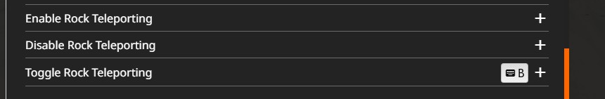
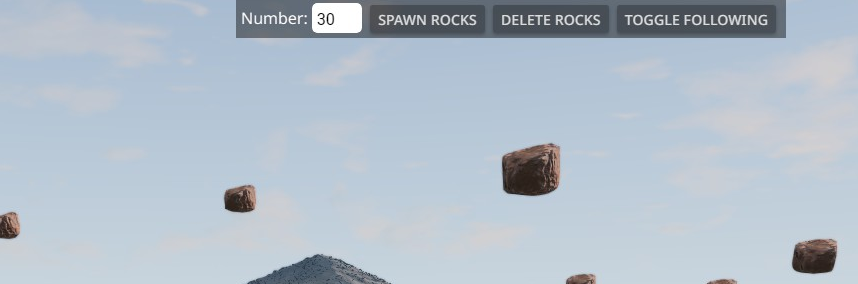

# Rock Madness

* What is? Makes with the spawning and the following and the raining and the destruction
* How do? Add the rock madness UI app, push button, receive rock madness
* Why tho? Because chaos
* Safe tho? Probably not. Use at your own risk. It hasn't melted my PC, no guarantee it won't melt yours.
* How configure? Can't. Unless you want to edit the rockMadness.lua file (in which case, can). Config via ui app not a thing (yet? ever? never?)
* Why's it limited to 40 rocks in the UI app? Because 40 is heaps. You can manually spawn more if you want, but the more rocks the worse the performance, and the longer the wait for them to spawn.

*Note: When spawning rocks, especially large amounts, beamng may appear to freeze. Just leave it. It's doing the same thing it does when it spawns AI vehicles (it thinks the rocks are cars)*

*Noteus Note the 2nd: Beam might tell you you can tab to the other "cars", it lies. Switching to the rocks is forbidden, you can't drive them anyway.*

*Note the three: When removing the rocks with the delete button, it just removes anything with the matching rock jbeam. If you've manually placed some rocks on the map, it'll probably take those with it*

# Install

* BeamNG launcher -> manage user folder -> open in file explorer
* Browse to (or create) the `mods/unpacked` folder
* Place the `rockmadness` folder inside the `unpacked` folder
    * Folder structure should look like `mods/unpacked/rockmadness` inside of which should be this readme, lua and ui directories.

# Configure

* Within BeamNG, go to your keybinds, under `Gameplay` there will be 3 new options: Enable, Disable, and Toggle Rock Teleporting.
    * You only need to bind a key to "Toggle Rock Teleporting", Enable and Disable can be bound if you'd like more discrete control.

* In BeamNG's escape menu, navigate to `UI Apps` and add the rock madness UI app. From there you can spawn and delete the rocks, and toggle their teleporting behaviour.

* You may manually edit the `rockMadness.lua` file in the `lua` directory to change the parameters of the script.
    * minHeight - the lowest height above the player the rocks will teleport to.
    * maxHeight - the maximum height above the player the rocks will teleport to.
        * These two combined dictate how long it takes the falling rocks to reach the player. Lower = more chaos, higher = more time to escape the rocks.
    * distXY - how far ahead/behind/to the side of the player to spawn the rocks. Bigger number = they'll spawn farther away.
    * delay - the time between each teleport event. *note: This may be affected by framerate* Anywhere from 0.25 - 0.5 is a pretty sane value.

# Disclaimers etc

This mod / script is provided as-is with no guarantee or warranty. If it works it works, if it doesn't, it doesn't. BeamNG (in)frequently receives updates and could break this mod in the future.